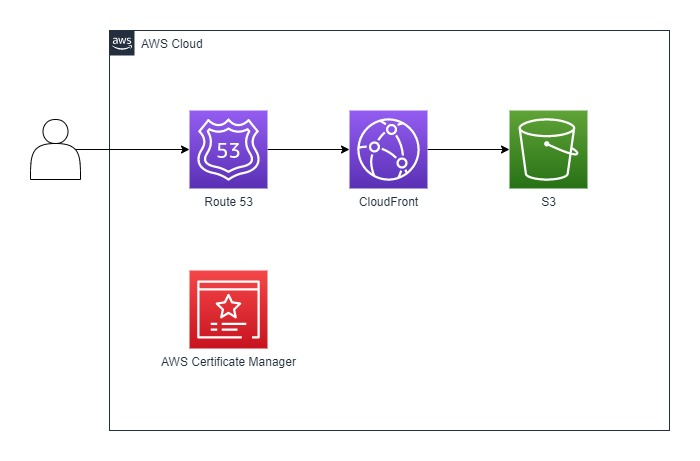

# S3ホスティングサービスをCloudFront経由で独自ドメインによりアクセスする方法

## 前提
- 証明書をCloudFrontと紐づけるため、米国東部 (バージニア北部) リージョン (us-east-1)にて証明書を発行する。
- 証明書をドメイン認証する際は、発行されたRoute53のCNAMEレコードのネームサーバ名をドメイン取得・管理サービスへ手動で登録し、Terraformによる自動化は行わない。
- 証明書とCloudFrontの紐づけは手動で行い、Terraformによる自動化は行わない。

## 実現したいこと
S3ホスティングサービスのシステム構成をRoute53、CloudFront、AWS Certificate Managerを利用して実現する。

## システム構成図
想定するシステム構成は以下の通り<br>


## 事前準備
1. ローカル端末にTerraformをインストール
2. ローカル端末にAWS CLIをインストール
3. 以下の権限を有するIAMポリシーに紐づいたIAMユーザーを用意し、ローカル端末でAWS CLIでIAMクレデンシャル情報を設定する。
   1. AmazonS3FullAccess
   2. AmazonRoute53FullAccess
   3. CloudFrontFullAccess
   4. AWSCertificateManagerFullAccess

## 使用方法
1. main.tfファイル直下に移動し、以下のコマンドを実行する
    ```
    terraform init
    terraform plan
    terraform apply
    ```

2. 利用を終了したい場合、以下のコマンドで削除する
    ```
    terraform destroy
    ```

## ライセンス
MIT.
